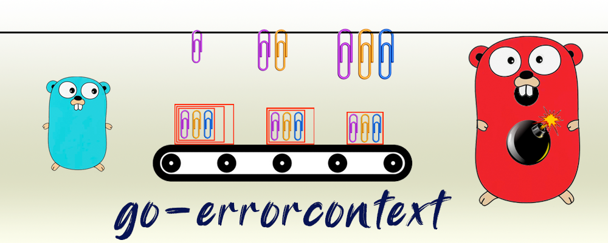

<div align="center" style="margin-bottom:20px">
  
  <div align="center">
    <a href="https://github.com/blugnu/go-errorcontext/actions/workflows/qa.yml"></a>
    <a href="https://goreportcard.com/report/github.com/blugnu/go-errorcontext" ></a>
    <a>= 1.14" src="https://img.shields.io/github/go-mod/go-version/blugnu/go-errorcontext?style=flat-square"/></a>
    <a href="https://github.com/blugnu/go-errorcontext/blob/master/LICENSE"></a>
    <a href="https://coveralls.io/github/blugnu/go-errorcontext?branch=master"></a>
    <a href="https://pkg.go.dev/github.com/blugnu/go-errorcontext"></a>
  </div>
</div>

<br/>

# go-errorcontext

A trivial `go` package providing an `error` implementation that wraps any other `error`, capturing the `context`.  The `errorcontext.With()` function is provided to simplify this:

```golang
    if err := db.QueryContext(ctx, sql, args); err != nil {
        return errorcontext.Wrap(ctx, err, "database query")
    }
```

The `error` returned by `Wrap()` has an idiomatic string representation of a wrapped error, equivalent to:

```
    "database query: %v", err
```

In addition to wrapping errors, `errorcontext` can also be used to create new errors that do not wrap any other error:

```golang
    if fooParam == "" {
        return errorcontext.New(ctx, "required fooParam not specified")
    }
```

Whether wrapping an error or creating a new one, the captured `context` is ultiamtely retrieved (if required) when handling a returned error by unwrapping the `ErrorWithContext` and calling the `Context()` function on that error to obtain the "most wrapped" `context` wrapped within the error.

The `errorcontext.FromError()` function provides a convenient way to do this, also accepting a default `context` (usually the current context) to use if no `context` is captured by the `error`:

```golang
    if err := SomeFooService(ctx, fooId); err != nil {
        ctx := errorcontext.FromError(ctx, err)
        log := logger.FromContext(ctx)
        log.Error(err)
        return
    }
```

<br>

# Intended Use

The intended use of `ErrorWithContext` is for reducing "chatter" when logging errors, particularly when using a context logger to enrich structured logs.

<br>

## The Problem

1. A `context` enriched by a call hierarchy is most enriched at the deepest level of that call hierarchy.
2. A hierarchy of `error`s wrapped by a call hierarchy is most wrapped at the shallowest level of that call hierarchy.

Errors logged only at the _deepest_ level of a call hierarchy can be enriched with the most context information, but lack any information about the call hierarchy resulting in that error.

Errors logged at (or close to) the _root_ of a call hierarchy can provide the most information about the call hierarchy leading to the error, but lack any of the context enrichment provided by that call hierarchy.

What often then happens is that errors are logged at every level in the call hierarchy, resulting in multiple error logs for a single error, one of which contains the call hierarchy information and another the greatest context enrichment.  Every other log entry for that error contains an incomplete representation of both context and call hierarchy.

<br>

`ErrorWithContext` addresses this dilemma by providing a mechanism for returning the context at each level back _up_ the call hierarchy.

A simple convention then ensures that the error is logged _only once_ **and** with the greatest possible amount of context enrichment.

The convention has two parts:

1. If an error is returned, it is _**not**_ _logged_ but returned, _wrapped by an ErrorWithContext_
2. If an error is _**not**_ returned (usually at the effective root of the call hierarchy), it is logged, using a `context` extracted from the `error` and a logger initialised from that context

Informational and warning logs may of course continue to be emitted at every level in the call hierarachy.